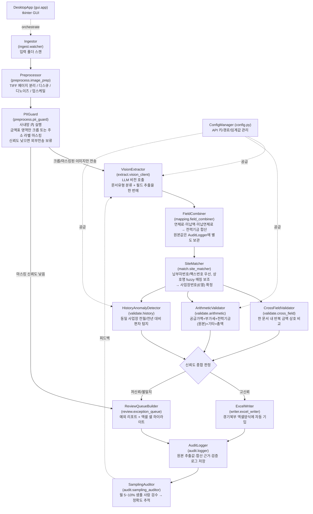

# 전기료 고지서 자동 추출·검증 툴 — 기술 설계서 (spec.md)

- 작성일: 2026-08-20
- 대상 업무: 자산운용팀 — 건물/아파트 관리사무소 발행 전기료 고지서(월 약 700건) 금액 추출 → 엑셀 양식 기입 → 검증
- 참고 데이터: `jasan_bills/bills_png/` 폴더 내 팩스 수신 TIFF 원본(현재 767건, 파일명 패턴 `<팩스번호>_<YYYYMMDDHHMMSS>.tif`), `경기북부 엑셀양식.xlsx`

---

## 0. 배경 요약 (샘플 확인 결과)

- 원본은 스캔본이 아니라 **팩스로 수신된 1728px 폭의 흑백(1-bit) TIFF**. 헤더에 `From/To/Page` 정보가 인쇄됨.
- 문서 유형이 최소 3종 혼재: ①국세청 세금계산서/계산서(격자 박스형), ②관리비 고지서(관리사무소마다 레이아웃 상이, 한 페이지에 고지서+납입통지서+수납의뢰서+납입영수증이 반복 인쇄), ③수기 영수증.
- 한 TIFF 파일이 여러 프레임(페이지)을 포함하기도 하고, **한 페이지 안에 서로 다른 청구 건이 여러 개 붙어 있는 경우도 있음**(예: 세금계산서 2건이 위아래로 인쇄된 샘플).
- 현재 엑셀 양식(Q~X열)에는 **연체료 전용 컬럼이 없음** → 아래 설계 결정 1.1에서 처리.

---

## 1. 주요 설계 결정 (Q&A)

### 1.1 연체료·미납액·미납연체료 → `전력기금`(W열) 합산

사용자 지시에 따라 엑셀 기입 시 다음과 같이 처리한다.

```
W(전력기금, 엑셀 기입값) = 전력기금_원본 + 연체료 + 미납액 + 미납연체료
```

다만 이 합산값만 저장하면 나중에 금액이 이상해도 어떤 항목 때문인지 추적할 수 없다. 따라서:

- **추출 단계에서는 4개 항목을 각각 별도 필드로 추출**하고,
- **`FieldCombiner` 모듈에서 합산해 W열에 기입**하며,
- **`AuditLogger`가 원본 4개 값 + 합산 근거를 별도 로그(JSON/CSV)로 남긴다.**

이렇게 하면 W열 값이 이상해 보일 때 "전력기금 자체가 이상한 건지, 연체료가 이상한 건지"를 즉시 확인할 수 있다. 산술 검증(§5)도 합산 전 원본 값 기준으로 수행한다.

### 1.2 문서 유형 자동 분류는 어디서 하나?

**별도의 classical 전처리 단계로 두지 않고, LLM 비전 추출 호출 한 번에 통합한다.** 이유:

- TIFF 페이지 분리(멀티프레임 → 개별 이미지), 디스큐/디노이즈/업스케일 같은 **결정적 이미지 처리**는 전처리 단계(`image_prep`)에서 LLM 호출 이전에 수행한다. 이건 classical CV로 충분하고 비용도 안 든다.
- 하지만 "이 페이지가 세금계산서인지 관리비고지서인지, 페이지 안에 청구 건이 몇 개 들어있는지"는 레이아웃 변동성이 너무 커서 규칙 기반 분류기로는 안정적으로 못 만든다. **LLM 비전 호출의 출력 스키마 자체를 `documents: [{doc_type, site_hint, fields...}, ...]` 배열로 설계**해서, 한 번의 호출로 "몇 건이 있는지 판단 + 유형 분류 + 필드 추출"을 동시에 처리한다. 로스텔오피스텔 샘플처럼 한 페이지에 2건이 붙어 있어도 배열로 2건이 반환되도록 프롬프트/스키마를 짠다.
- 이렇게 하면 별도의 분류 모델/호출이 필요 없어 **API 호출 횟수와 비용이 줄고**, 문서 유형이 늘어나도 프롬프트의 few-shot 예시만 추가하면 되어 유지보수도 쉽다.
- (선택적 최적화, Phase 4 이후) 호출 비용이 부담되면 파일명 패턴이나 저해상도 썸네일 키워드 검색으로 "이미 알려진 사업장의 고정 양식"만 걸러 캐시된 템플릿으로 빠르게 처리하고, 나머지만 풀 LLM 호출로 보내는 하이브리드 라우터(`template_store`)를 추가할 수 있다. 이건 MVP에는 불필요.

### 1.3 실행파일로 만들어 업무용 PC에 배포 가능한가?

**가능하다.** Python은 PyInstaller(또는 Nuitka)로 `.exe`로 패키징할 수 있고, Inno Setup 등으로 설치 프로그램(바탕화면 아이콘, 시작메뉴, 제거 기능 포함)까지 만들 수 있다. 다만 실무 배포 시 아래를 미리 고려해야 한다.

- **인터넷 연결 필수**: LLM API는 클라우드 호출이므로, 사내 PC가 `api.anthropic.com`(또는 사내 프록시)에 접속 가능해야 한다. 방화벽/프록시 예외 등록이 필요할 수 있어 IT 부서 협의가 선행돼야 함.
- **API 키 보안**: exe 안에 키를 하드코딩하면 문자열 추출로 노출될 위험이 있다. MVP는 사용자별로 키를 입력받아 OS 자격증명 저장소(Windows DPAPI, `keyring` 라이브러리)에 암호화 저장하는 방식을 권장. 여러 명이 쓰는 조직 도구라면, 나중에는 **키를 서버(사내 중계 API)에만 두고 exe는 사내 엔드포인트만 호출**하는 구조로 바꾸는 게 비용 통제와 보안 면에서 더 낫다(Phase 5+).
- **GUI**: 비개발자가 쓰므로 최소한의 데스크톱 GUI(폴더 선택 → 실행 → 진행률 → 결과 엑셀/예외 리포트 열기)가 필요. 추가 런타임 설치 없이 쓰려면 Python 표준 라이브러리인 `tkinter` 기반이 배포에 가장 간단하다.
- **백신 오탐**: PyInstaller onefile exe는 Windows Defender/사내 백신에서 오탐(false positive)되는 경우가 흔하다. 사내 코드서명 인증서가 있으면 서명해서 배포하고, 없으면 IT에 예외 등록을 요청해야 한다.
- **배포/업데이트**: 초기에는 사내 공유드라이브에 새 버전 exe를 올려 교체하는 방식으로 충분하고, 사용자가 많아지면 버전 체크 후 자동 업데이트를 추가할 수 있다.

### 1.4 LLM 사용 시 추가 비용이 발생하는가?

**발생한다.** 지금 대화에 쓰이는 Claude(Cowork) 구독과는 별개로, 이 툴은 **Anthropic API(또는 AWS Bedrock/GCP Vertex의 Claude)를 API 키 기반 종량제**로 호출해야 한다. Anthropic Console에서 별도 결제 계정 설정이 필요하다.

대략적인 비용 추정 (Claude Sonnet 5 기준, 입력 $2/백만 토큰, 출력 $10/백만 토큰):

- 이미지 토큰은 `⌈가로/28⌉ × ⌈세로/28⌉`로 계산된다. 샘플 크기(약 1728×1150px) 기준 페이지 1장당 약 2,600~3,000 토큰. 프롬프트(스키마+지시문) 500~800 토큰, 출력 JSON 200~400 토큰을 더하면 **페이지 1장당 약 3,500~4,000 입력 토큰 + 300~500 출력 토큰** 수준.
- 월 700건(멀티페이지·멀티문서 고려해 실제 이미지 호출 800~900건 가정) → **월 약 1만~2만 원 내외**(환율·모델에 따라 변동)로, 인건비 대비 매우 저렴한 수준이다.
- 더 저렴한 Haiku 4.5(입력 $1/출력 $5)로 1차 추출을 시도하고, 신뢰도가 낮은 건만 Sonnet으로 재시도하는 2단계 전략도 비용을 더 낮출 수 있다(Phase 4+ 최적화).
- 참고로 반복되는 시스템 프롬프트(스키마/지시문)는 prompt caching을 적용하면 추가로 절감된다.

> 출처: [Claude Platform Pricing](https://platform.claude.com/docs/en/about-claude/pricing), [Claude Vision 문서 - 이미지 토큰 계산](https://platform.claude.com/docs/en/build-with-claude/vision)

### 1.5 주소 등 개인정보를 외부 API로 보내지 않으려면?

**"응답에서 주소 필드를 요청하지 않는 것"만으로는 부족하다.** 이미지 전체를 API에 보내는 한, 모델에게 주소를 읽어달라고 요청하지 않아도 주소가 찍힌 픽셀 자체가 외부로 전송된다. 따라서 진짜 최소화는 **"어떤 필드를 반환받을지"가 아니라 "어떤 이미지 영역을 애초에 전송할지"를 통제**하는 문제다. `preprocess` 단계에 `pii_guard.py`(PIIGuard) 모듈을 추가해 **외부 API 호출 이전, 사내망 안에서만** 동작시킨다.

**방식 A — 화이트리스트 크롭 (권장, 대부분의 정기 발생 사업장에 적용 가능)**
같은 관리사무소는 매달 거의 동일한 레이아웃을 보낸다. 사업장별로 "금액 표 영역"의 좌표를 한 번 확인해 `template_store`에 저장해두고, 이후에는 **그 좌표로 크롭한 금액 표 조각만** 외부 LLM에 전송한다. 상호명·주소·세대 정보가 있는 헤더/공지사항 영역은 처음부터 API 요청 바이트에 포함되지 않는다. 이 방식은 "마스킹을 깜빡해서 유출"되는 실패 모드가 구조적으로 없다 — 보낼 영역을 허용 목록으로 정하는 것이라, 실수해도 "덜 보내서 추출 실패"로 끝나지 실수로 개인정보가 새어나가지는 않는다.

**방식 B — 라벨 기반 마스킹 (신규/미등록 양식, 수기 영수증 등 크롭 좌표를 모르는 경우의 보완책)**
사내망 안에서 완전 오프라인으로 동작하는 경량 로컬 OCR(예: Tesseract-kor, PaddleOCR)로 "주소", "소재지", "고객명" 같은 라벨의 위치만 찾아 그 옆/아래 값 영역을 검은 사각형으로 지운 뒤 전송한다. 이건 라벨 인식을 놓치면 유출 위험이 남는 방식이므로, **마스킹 신뢰도가 낮게 나온 건은 아예 외부 전송을 보류하고 `review.exception_queue`로 돌려 담당자가 수동 처리**하도록 안전장치를 둔다.

**사업장 매칭에도 주소 텍스트가 필요 없다.** 이미 §3의 `site_matcher`가 팩스 발신번호·납부자번호 같은 고정 식별자로 우선 매칭하도록 설계돼 있으므로, 크롭된 금액 표만 보내도 사업장 식별에는 지장이 없다. `extract.schema`의 `site_hint_text` 필드도 상호명 정도로 최소화하고 주소는 애초에 스키마에 두지 않는다(이미 반영됨).

**조직/계약적 보완책(기술적 최소화와는 별개로 검토 권장):** Anthropic API는 기본적으로 응답 반환 후 프롬프트/출력을 저장하지 않고 모델 학습에도 사용하지 않으며, 영업팀에 요청하면 Zero Data Retention(ZDR) 계약도 가능하다고 공식 문서에 명시돼 있다. 다만 이는 "저장·학습을 안 한다"는 것이지 "전송 자체를 안 한다"는 뜻은 아니므로, 법무팀이 검토하는 규정이 **전송 자체를 금지**하는지 **제3자 저장/이용을 금지**하는지에 따라 이 보완책의 필요성이 달라진다. 크롭/마스킹으로도 사내 정책상 "외부 전송 자체가 불가"하다는 결론이 나오면, 온프레미스 오픈소스 vision 모델이나 AWS Bedrock 같은 VPC 내 프라이빗 엔드포인트로 전환하는 방안까지 검토해야 하며 이는 별도 비용·성능 트레이드오프가 있다.

> 출처: [Anthropic API 데이터 보존 정책](https://platform.claude.com/docs/en/manage-claude/api-and-data-retention)

---

## 2. 전체 파이프라인 개요



---

## 3. 모듈 구성 (Python 패키지 트리)

```
jasan_bill_extractor/
├── main.py                       # CLI 진입점 (Orchestrator)
├── config.py                     # ConfigManager: API 키, 경로(기본 입력 폴더 = jasan_bills/bills_png/), 임계값, 사업장 마스터 위치
│
├── ingest/
│   └── watcher.py                # Ingestor — 입력 폴더(jasan_bills/bills_png/) 스캔, 신규 파일 목록화, 처리 상태 추적
│
├── preprocess/
│   ├── image_prep.py             # Preprocessor — TIFF 프레임 분리, 디스큐, 디노이즈, 업스케일
│   └── pii_guard.py              # PIIGuard — 외부 전송 전 사내망에서 주소 등 크롭/마스킹 (§1.5)
│
├── extract/
│   ├── vision_client.py          # VisionExtractor — LLM 비전 API 래퍼, 재시도/타임아웃 처리
│   ├── schema.py                 # Pydantic 스키마: documents[] (doc_type, site_hint, 필드들, 신뢰도)
│   ├── prompts.py                # 문서유형별 프롬프트 + few-shot 예시
│   └── template_store.py         # (Phase 4+) 사업장별 학습된 템플릿/예시 캐시
│
├── mapping/
│   └── field_combiner.py         # FieldCombiner — 연체료 등 합산 규칙 적용, 원본값 보존
│
├── match/
│   ├── site_master.py            # 사업장 마스터(사업장번호/납부자번호/팩스번호/상호명 별칭) 로딩
│   └── site_matcher.py           # SiteMatcher — 고정식별자 우선 매칭 + fuzzy 매칭 보조
│
├── validate/
│   ├── cross_field.py            # CrossFieldValidator — 문서 내 반복 금액 상호 비교
│   ├── arithmetic.py             # ArithmeticValidator — 산식 검증
│   └── history.py                # HistoryAnomalyDetector — 이력 DB 대비 편차 탐지
│
├── writer/
│   └── excel_writer.py           # ExcelWriter — 경기북부 엑셀양식 컬럼 매핑 후 기입
│
├── review/
│   └── exception_queue.py        # ReviewQueueBuilder — 저신뢰 건 리포트 생성, 셀 하이라이트
│
├── audit/
│   ├── logger.py                 # AuditLogger — 원본 추출값/합산근거/검증결과 로그 저장
│   └── sampling_auditor.py       # SamplingAuditor — 월별 샘플 정확도 감사, 리포트 생성
│
├── gui/
│   └── app.py                    # DesktopApp — tkinter 기반 실행 UI
│
├── data/
│   ├── site_master.csv           # 사업장번호 ↔ 납부자번호/팩스번호/상호명 별칭 매핑
│   └── history.db                # 사업장별 월별 청구금액 이력 (SQLite)
│
└── build/
    └── build_exe.spec            # PyInstaller 빌드 설정
```

각 모듈은 이전 대화에서 제안한 아이디어에 아래와 같이 대응한다.

| 아이디어 | 대응 모듈 |
|---|---|
| LLM 비전 기반 추출 (규칙기반 OCR 대체) | `extract.vision_client`, `extract.schema` |
| 팩스 화질 보정 전처리 | `preprocess.image_prep` |
| 주소 등 개인정보 외부전송 최소화 (§1.5) | `preprocess.pii_guard` |
| 문서 내 중복 금액 교차검증 | `validate.cross_field` |
| 산술 검증 | `validate.arithmetic` |
| 이력 대비 이상탐지 | `validate.history`, `data/history.db` |
| 고정 식별자 우선 사업장 매칭 | `match.site_master`, `match.site_matcher` |
| 사업장별 템플릿 학습(선택) | `extract.template_store` |
| 문서유형 분류 (LLM 호출에 통합) | `extract.schema`, `extract.prompts` |
| 신뢰도 기반 예외처리 | `review.exception_queue` |
| 연체료 등 컬럼 매핑/합산 규칙 | `mapping.field_combiner` |
| 정확도 감사 루틴 | `audit.sampling_auditor` |
| 원본값 추적 로그 | `audit.logger` |
| 실행파일 배포 | `gui.app`, `build/build_exe.spec` |

---

## 4. 데이터 모델 (추출 스키마 초안)

```python
class ExtractedBill(BaseModel):
    doc_type: Literal["세금계산서", "관리비고지서", "수기영수증", "기타"]
    site_hint_text: str            # 페이지에서 읽은 상호명/건물명 원문 (매칭 보조용)
    fixed_id_candidates: list[str] # 납부자번호, 전자납부번호, 팩스 발신번호 등 고정식별자 후보
    billing_period: str | None     # 청구년월 (예: 202606)
    supply_amount: float | None    # 공급가액 (T열)
    vat_amount: float | None       # 부가가치세 (U열)
    power_fund_raw: float | None   # 전력기금 원본
    late_fee: float | None         # 연체료
    unpaid_amount: float | None    # 미납액
    unpaid_late_fee: float | None  # 미납연체료
    other_fee: float | None        # 기타요금(청소용역비 등)
    printed_total: float | None    # 고지서에 인쇄된 총액(검증 기준값, 보통 납기후금액)
    field_confidence: dict[str, float]  # 필드별 추출 신뢰도(0~1)
    source_regions: list[str]      # 어느 구역(고지서/납입통지서/영수증)에서 읽었는지, 교차검증용
```

---

## 5. 검증 로직 상세

1. **CrossFieldValidator**: 같은 페이지 내에서 동일 금액이 여러 구역(관리비고지서 / 납입통지서 / 수납의뢰서 / 납입영수증)에 반복 인쇄된 경우, 각 구역에서 개별 추출한 값을 비교. 불일치 시 신뢰도 하락 + 예외 큐 이동.
2. **ArithmeticValidator**: 합산 전 원본 값 기준으로 검증.
   ```
   printed_total ≈ supply_amount + vat_amount + power_fund_raw
                    + late_fee + unpaid_amount + unpaid_late_fee
                    + other_fee (오차 허용 ±10원, 원단위절사 고려)
   ```
3. **HistoryAnomalyDetector**: `history.db`에서 동일 사업장(사업장번호 기준)의 직전월·전년 동월 `청구요금계`를 조회해 편차율 계산. 임계값(기본 ±30%, `config.py`에서 조정 가능) 초과 시 예외 큐 이동.
4. **신뢰도 종합 판정(G 단계)**: 위 3개 검증 결과 + LLM이 반환한 `field_confidence`를 종합해 "자동기입" vs "검토필요"로 분기.

---

## 6. 개발 단계 (Phase별 실행 계획)

| Phase | 목표 | 산출물 | 완료 기준 |
|---|---|---|---|
| 0. 준비 | 사업장 마스터 데이터 정리(E열 사업장번호 ↔ 납부자번호/팩스번호/상호명), 연체료→전력기금 합산 규칙 확정, 검증 기준 총액(납기내/납기후 중 어느 걸 쓸지) 확정 | `data/site_master.csv` 초안 | 담당자 확인 완료 |
| 1. PoC | 샘플 30~50건으로 `VisionExtractor` 단독 프로토타입 제작, 문서유형별 프롬프트 검증 | CLI 스크립트, 추출 정확도 리포트 | 필드별 추출 정확도 측정치 확보 |
| 2. 전처리·검증 파이프라인 | `image_prep`, `cross_field`, `arithmetic` 모듈 추가, 배치 처리로 확장 | 파이프라인 통합 스크립트 | 30~50건에서 산술검증 통과율 측정 |
| 3. 매칭·이력 이상탐지 | `site_matcher`, `history` 모듈, `history.db` 구축(과거 데이터 백필 필요) | 사업장 매칭 정확도, 이상탐지 리포트 | 매칭 실패율 목표치 이하 |
| 4. 엑셀 기입 + 예외 리포트 | `excel_writer`, `exception_queue` 완성, 실제 엑셀 양식에 자동 기입 | 완성된 엑셀 산출물 + 예외 리스트 | 담당자가 예외 건만 확인해도 되는 수준 |
| 5. GUI + 패키징 | `gui.app` 개발, PyInstaller로 exe 빌드, 사내 배포 테스트(방화벽/백신 이슈 확인) | 설치 가능한 exe/installer | 비개발자가 단독 실행 가능 |
| 6. 파일럿 운영 | 실제 1~2개월치 데이터로 기존 수작업과 병행 운영, `sampling_auditor`로 정확도 추적 | 월별 정확도 리포트 | 목표 정확도(예: 95%+) 도달 시 전면 전환 |
| 7. 전면 운영 + 개선 루프 | 월간 샘플 감사 결과를 프롬프트/템플릿 개선에 반영 | 운영 매뉴얼 | 지속 운영 |

---

## 7. 리스크 및 고려사항

- **화질 하한선**: 팩스 원본이 극단적으로 흐릿한 경우(예: 0318136138 샘플처럼 세로 193px로 잘린 파일) 전처리로도 복구 불가 → 이런 건 애초에 "복구 불가"로 분류해 즉시 예외 처리하는 로직 필요.
- **연체료 통합 규칙 확정 필요**: 어떤 총액(납기내금액 vs 납기후금액)을 검증 기준으로 삼을지 실제 지급 관행에 맞춰 확정해야 §5 산식이 의미를 가짐.
- **API 키 보안/비용 통제**: 다수 사용자가 쓰는 사내 도구이므로 중장기적으로는 키를 서버 쪽에 두는 구조 전환 권장.
- **개인정보/기밀 데이터 처리**: §1.5의 PIIGuard(화이트리스트 크롭 우선, 라벨 마스킹 보완)로 주소 등이 담긴 이미지 영역 자체를 외부로 보내지 않도록 설계했다. 다만 "동/호"까지 개인정보로 볼지, 사업자등록번호는 어디까지 허용되는지 등 정확한 범위는 법무팀과 함께 확정해야 하고, 크롭/마스킹으로도 불충분하다는 결론이 나올 경우를 대비해 온프레미스/VPC 전환 옵션도 열어둔다.

---

## 8. 참고자료

- [Claude Platform Pricing](https://platform.claude.com/docs/en/about-claude/pricing)
- [Claude Vision — 이미지 토큰 계산](https://platform.claude.com/docs/en/build-with-claude/vision)
- [Anthropic API 데이터 보존 정책 (Zero Data Retention 포함)](https://platform.claude.com/docs/en/manage-claude/api-and-data-retention)
